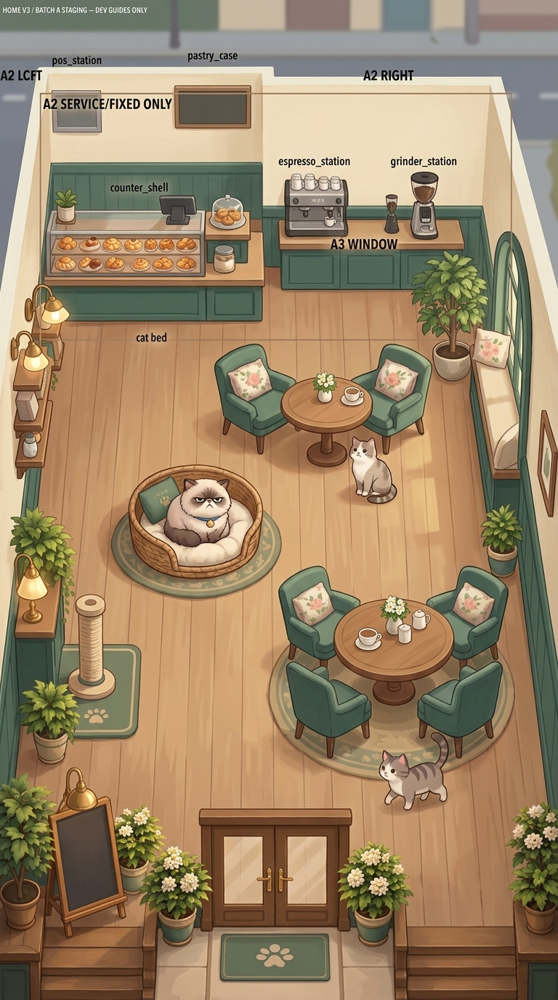

# WILLICAT HOME V3 ROOM VISUAL INTEGRATION PROOF V1

This artifact contains the visual integration proof for the Home V3 Staggered Salon, evaluating the course-correction back towards an illustrated storybook style ("60% illustrated storybook, 40% miniature diorama") and away from architectural rendering.

**Notes:**
This is a DEV / REFERENCE artifact only. It is a visual master/composition proof, not production art. Do not use for asset slicing, as layout guide texts were retained by the image generator.
