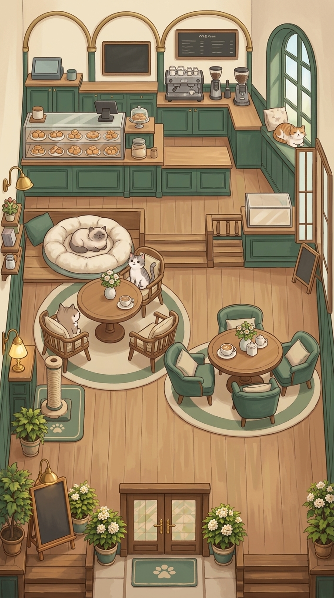

# WILLICAT HOME V3 ROOM VISUAL INTEGRATION PROOF V1_1

This artifact contains the revised visual integration proof for the Home V3 Staggered Salon layout, utilizing the clean Godot composition guide as spatial authority.

**Notes:**
This is a DEV / REFERENCE artifact only. It serves as a visual master/composition proof, not production art. Do not use for direct asset slicing due to generative geometry drift.
