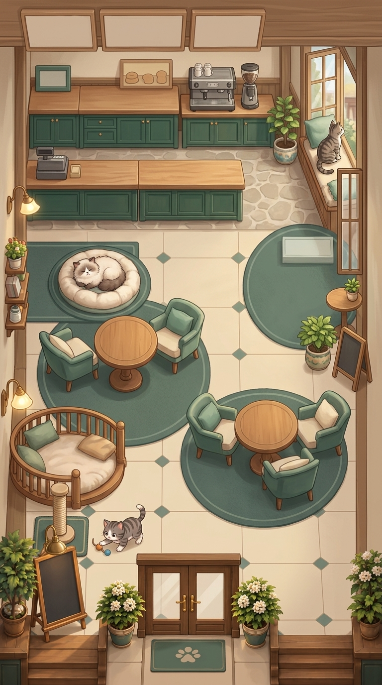

# WILLICAT HOME V3 ROOM VISUAL INTEGRATION PROOF V1_2

This artifact contains the corrected visual integration proof for the Home V3 Staggered Salon layout, utilizing the clean Godot composition guide as spatial authority.

**Notes:**
This is a DEV / REFERENCE artifact only. It serves as a visual master/composition proof, not production art. This version successfully corrects the generative geometry drift from V1.1 by restoring the separate right-side window perch, removing the hallucinated mid-right stairs/display case, enforcing strict blank signage with zero text, and maintaining exactly three cats.
