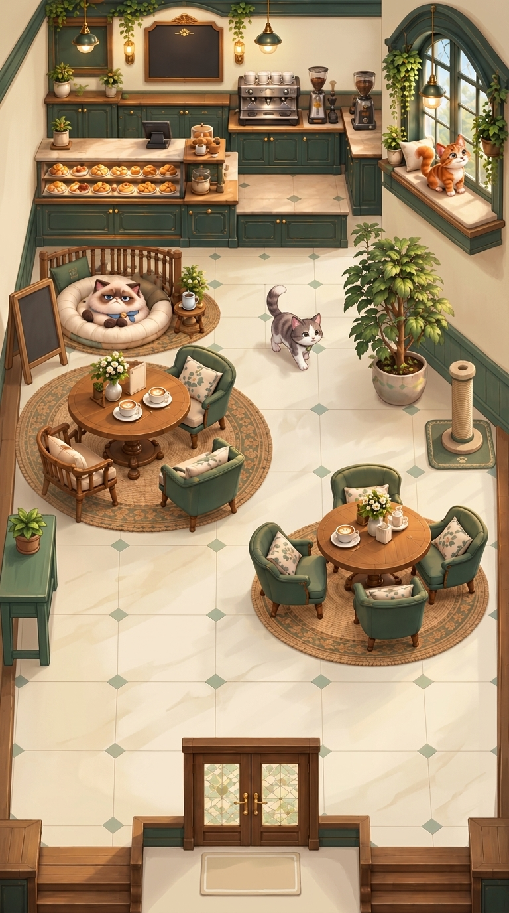

# WILLICAT HOME V3 ROOM VISUAL INTEGRATION PROOF V1_3

This artifact contains the final cohesive room-level visual proof for the locked WilliCat Home V3 café.

**Notes:**
This is a DEV / REFERENCE artifact only. It serves as an illustrated room proof to confirm that the locked Godot geometry can be rendered beautifully in the WilliCat visual identity. It is not final production art slicing. 

**Generative Improvements over V1.1 and V1.2:**
- Uses the Strong Control Composition Guide to strictly enforce the structural geometry.
- Text labels and debug typography have been successfully eradicated.
- The separation between the service zone and the right window perch is maintained.
- Open circulation routes have been preserved without being filled with extra decorative geometry.
- The visual style successfully lands at a 60% illustrated storybook / 40% miniature diorama balance.
