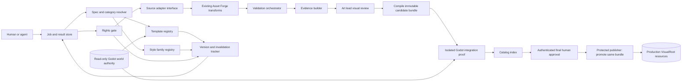
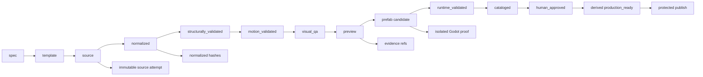
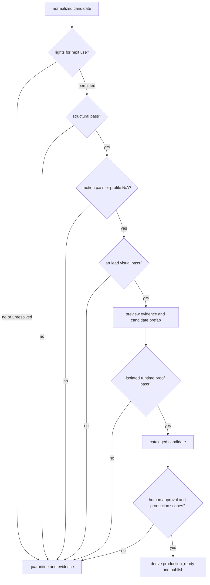
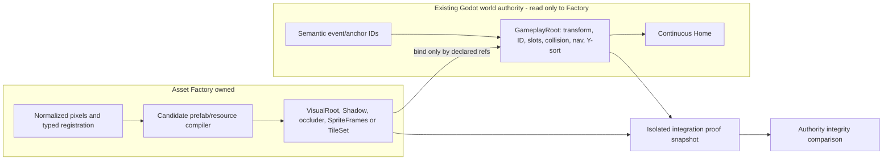
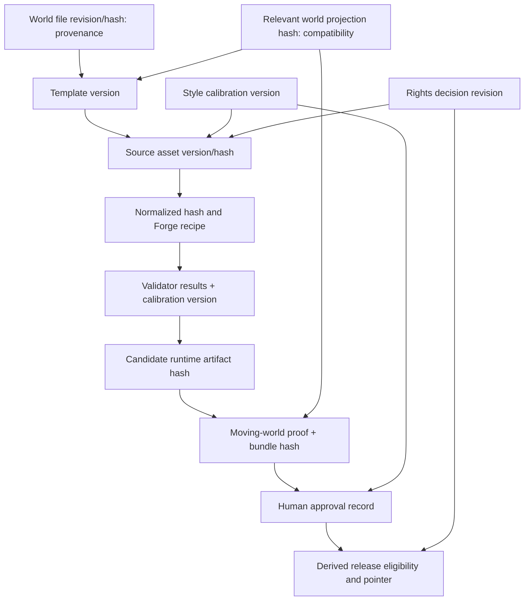

# WilliCat Asset Factory architecture V1

Status: **APPROVED IN DIRECTION WITH REQUIRED HARDENING AMENDMENTS COMPLETED; ready for final human implementation authorization.** This document is still architecture, not implementation or asset approval. Inputs are the [provider evidence](../research/WILLICAT_ASSET_PROVIDER_PRODUCTION_BEST_PRACTICES_RESEARCH_V1.md), [ecosystem stages and gates](WILLICAT_ASSET_ECOSYSTEM_STANDARD_V1_DRAFT.md), [registration and motion contract](WILLICAT_ASSET_REGISTRATION_AND_MOTION_CONTRACT_V1_DRAFT.md), [hardened manifest](WILLICAT_ASSET_MANIFEST_SCHEMA_V1_DRAFT.md), [terrain/animation/VFX/UI rules](WILLICAT_TERRAIN_ANIMATION_VFX_UI_STANDARD_V1_DRAFT.md), [provenance policy](../production/WILLICAT_PROVIDER_PROVENANCE_POLICY_V1_DRAFT.md), and [hardening result](WILLICAT_ASSET_SPECIFICATION_HARDENING_V1_RESULT.md). Those drafts define the baseline vocabulary; the hardening rules here make its implementation boundary explicit. The existing `tools/willicat_asset_forge/` code was inspected, not executed or changed.

## 1. Context and goals

Mini Pack 001 proved that visual swaps can preserve a moving actor, interaction and Home navigation, while human review rejected several asset families. The Factory's job is to make **specification, registration, rights, structural/motion checks, evidence and human decisions** explicit before production promotion. It is a local, file-based coordinator of tools and reviews for one game, with inspectable failures and reproducible deterministic outputs. It must support both authored and provider-generated first-party source without requiring any provider.

## 2. Non-goals

No art creation, provider connection, validator implementation, Godot scene edit, world layout editor, custom DCC, distributed scheduler, legal-rights inference, or automatic beauty score is part of this architecture deliverable. The proposed repository tree is not a migration order. Asset Forge remains available for its existing work.

## 3. Locked invariants

Godot Home world data owns transforms, navigation, collision, interaction anchors, save IDs, camera and gameplay semantics. Geometry is extracted into a versioned template **before** source art; art is rejected when it cannot register. Direction, action, state, timeline and variant are separate; art tiles and logical placement cells may differ. Technical gate results never imply visual approval. `production_ready` is a computed predicate, never stored as a writable boolean. Authenticated human visual/final approval, current asset-relevant authority compatibility and action-specific use-scoped rights are mandatory. Failed assets never enter `production_world`; controlled isolated diagnosis is allowed. Third-party production grammar informs original WilliCat art, not generative conditioning absent permission. Unmeasured geometry and motion limits stay unmeasured.

## 4. Existing Asset Forge audit and responsibility map

Code evidence: `cli.py`, `app.py`, `forge.py`, `sprite_sheet.py`, `image_processing.py`, `webp_processing.py`, `qa.py`, `animation_preview.py`, `godot_export.py`, `static_prop.py`, `models.py`, `registry.py`, `config.py`, profiles and five test modules. README describes v1.0, while `config.py` says 1.2.0; compatibility/version identity needs an explicit wrapper contract.

| Existing subsystem | Observed current responsibility | Factory decision / boundary |
|---|---|---|
| `cli.py`, Streamlit `app.py` | Inspect/build/export character strips, list profiles; `build-static` packages one PNG. GUI previews and exposes build controls. | Keep independent as legacy operator surfaces. New Factory CLI calls a constrained Forge service API; neither old UI nor CLI becomes a gate authority. |
| `forge.py`, `sprite_sheet.py`, `webp_processing.py` | PNG/WebP intake, grid/content-strip/explicit-edge extraction, frame output and horizontal atlas. `run_pipeline` also emits manifest and `.tres`. | Reuse deterministic extraction and atlas logic with a future refactor that separates transforms from output policy; wrap legacy pipeline only in isolated candidate output until refactored. No rewrite. |
| `image_processing.py` | RGBA, padding, resizing, alpha halo, root-preserving canvas expansion. | Reuse as processing functions; Factory supplies template-derived root/canvas parameters. Resizing alone is not registration proof. |
| `qa.py`, `animation_preview.py` | Frame alpha bounds, center/baseline variation, warnings, GIF/APNG previews. | Reuse measurements/preview helpers; their `PASS`/`WARNING` is diagnostic input, not a `structural`, `motion` or `visual` gate result. |
| `static_prop.py` | Immutable-source hash check, crop or preserve-canvas path, expected-size/alpha checks, pivot metadata, runtime PNG/JSON. | Reuse processing where category profile allows; never use trimmed contact pivot for fixed architectural layers. `technical_qa=PASS` has no production meaning. |
| `godot_export.py` | Generates a character SpriteFrames `.tres` with horizontal equal-size cells, uniform `fps`, `duration: 1.0`. | Reuse for legacy uniform clips; extend/refactor for explicit `frame_map`/`durations_ms` and category resources later. It is a resource writer, not an approval/publishing authority. |
| `models.py`, `registry.py`, `profiles/` | Small character/action dataclasses and JSON profiles; legacy manifest has character/action/direction/status/fps/QA. | Remain legacy inputs. Add a mapping boundary; do **not** confuse old `AssetManifest` or character profiles with the hardened category/stage manifest or template/style registries. |
| `tests/` | Core transforms, static prop and specific Mochi acceptance/immutability/resource checks. | Keep as regression tests. Add Factory contract tests in MVP; existing tests do not prove rights, motion quality, visual coherence or Home integrity. |

**Observed enforcement gaps:** `--status FINAL` is exposed directly in CLI/GUI and static packaging; `forge.py` writes named output and `.tres` regardless of QA warning; `export-godot` reruns processing; paths are character-centric and suggested deployment is manual. Output names end in `_v1` and can be overwritten by subsequent runs. There is no hardened stage/category manifest, immutable attempt history, scoped-rights gate, typed connectors/apertures/terrain, per-frame timing handoff, human evidence record, authority revision check, or protected production publisher. These are Factory responsibilities or future Forge extensions. Deprecate the *meaning* of legacy `FINAL` in Factory jobs; do not silently alter old workflows. The Factory must never accept it as `human_approved`.

## 5. Component architecture and boundaries



The following matrix specifies each component's contract. `D` deterministic, `N` nondeterministic, `H` human judgment. “Store” means file-based persistence; no service database is proposed.

| Component | Responsibility; input → output | Depends on; class/owner; persistence and failure | Does not own |
|---|---|---|---|
| Job/result store | Request and attempt ledger; request + version pins → immutable attempts, stage pointers, cancellation/supersession | Manifest, hashes; D/machine; append records and atomic current pointer; fail closed on write conflict | Art, gate judgment, world data |
| Spec/category resolver | Load hardened schema/profile; request → stage obligations and required validators | Manifest spec; D/machine; records resolved profile/version; invalid profile blocks | Drawing or measured geometry |
| Template registry | Resolve versioned registration contract from authority snapshot; template ID/version → geometry, connector, motion plan refs | Read-only Home authority; D/technical artist authors template, machine resolves; versioned files; missing values block SOURCE | Moving Home geometry |
| Style family registry | Store calibration versions/states and evidence; style ID/version → `approved` or unapproved calibration | Art lead; H approval, D lookup; versioned files; unapproved blocks SOURCE | World geometry or automatic style verdict |
| Rights service | Evaluate requested use scopes against evidence; sources/inputs + scope → recorded assessment | Provenance policy; D lookup + rights-owner judgment; revisioned decision file; unresolved/prohibited blocks use | Legal interpretation by code |
| Source adapter boundary | Manual intake/generate/revise/variant request → immutable source files and provider receipt | Rights + template + style; N for provider, D for intake; attempt receipt and hashes; retry only to new attempt | Gate decisions or core provider-specific prompts |
| Forge processing boundary | Versioned processing request → normalized exports, diagnostics, file hashes | Existing Forge functions; D/machine; immutable attempt workspace; processing error quarantines | Approval or production publication |
| Validation orchestrator | Profile/stage selects validator versions; inputs → independent gate evidence/results | Resolver, calibration, rights; D/machine; append result; missing validator/policy blocks, never assumes pass | Validator algorithms or art judgment |
| Evidence builder | Diagnostics/proof refs → contact sheets, overlays, loop/capture records | Forge, validators, proof scene; D for rendering, H for interpretation; content-addressed refs; missing artifact blocks gate | Replacing a review decision |
| Human review boundary | Art-lead review before candidate compile; final review of exact bundle/evidence/version tuple after proof → authenticated approval, rejection, revision or hold | Evidence + style + proof + verifier; H/human reviewer; append authenticated record; unverified record blocks | Editing art in place or accepting a role string as identity |
| Candidate compiler + Godot adapter | Approved normalized data → one immutable candidate bundle, then isolated proof of that bundle | Forge outputs, template, rights, stage gates; D/machine; bundle hash and proof hash; compiler/proof failures block | Changing gameplay scene/navigation or recompiling after approval |
| Catalog + protected publisher | Index attempts and derive current approved version; promote proved bundle only if predicate true | All ledgers, reviewer, authority; D/machine; rebuildable index + append-only release history and serialized atomic pointer; stale/failed or revoked release is ineligible | Manually granting `production_ready` or rebuilding approved assets |
| Invalidation tracker | Dependency versions/revisions → current, potentially stale, invalid, needs review | Authority/template/style/rights/source graphs; D/machine, human compatibility decision; append invalidation evidence; uncertain compatibility blocks publish | Auto-repairing assets |

For simplicity, these are modules in one local tool process, not network services. The validation orchestrator and content validators are separate interfaces; candidate compiler and protected publisher are two capabilities even if later packaged together.

## 6. Deterministic, generative and human ownership

| Step | Class | Owner and rule |
|---|---|---|
| Resolve spec, template, profile, rights assessment, hashes, stage transitions | D | Factory; software enforces field, version and scope checks. Rights *interpretation* is a recorded rights-owner decision. |
| Create/revise source | N or H | Provider adapter or first-party artist; each attempt creates a new immutable source version/receipt. |
| Slice, normalize, measure, assemble atlas, compile Godot resources | D | Forge/Factory; repeatable from pinned inputs; no AI decides dimensions or parity. |
| Connector/aperture/terrain/frame parity, drift and seam measurement | D with calibrated policy | Validators; uncalibrated threshold yields blocked/needs calibration, not `passed`. |
| Motion measurements and calibrated checks | D | Motion validators emit traces and policy results; neither alone approves human-only motion quality. |
| Motion quality, family cohesion, style, actor-readable threshold | H informed by metrics | Technical animator/art lead; a numerically valid jelly tree can fail the motion gate through animator review and separately fail `visual`. |
| Runtime route, occlusion, semantic event and canonical world-authority projection comparison | D proof plus H inspection | Runtime owner proves the exact bundle; final human reviews moving actor evidence. |
| Final `human` gate | H with authentication | Human approval verifier validates principal, credential identity, signed payload and exact bundle/evidence tuple. |

## 7. Job model and transition semantics

`job_id` identifies a request, not an asset. The request pins `asset_id`, `category`, target `lifecycle_stage`, `template_id`/`template_version`, `style_family_id`/calibration version, `world_authority_ref`, `world_authority_file_hash` or revision for historical provenance, `world_authority_projection_hash` for asset-relevant compatibility, provenance/input references, requested action/use scopes and source-adapter choice. An attempt has `attempt_id`, immutable source/normalized hashes, provider receipt, toolchain fingerprint, validator and calibration versions, gate records, evidence refs, bundle hash and current completed stage. An asset version may be superseded by a new attempt/version, never overwritten.

The canonical stages remain `spec → template → source → normalized → structurally_validated → motion_validated → visual_qa → preview → prefab → runtime_validated → cataloged → human_approved`. The six gate IDs remain `rights`, `structural`, `motion`, `visual`, `runtime`, `human`, with `not_started → pending → passed | failed`; a corrected attempt can retry from `failed → pending`, retaining old evidence. Profile-declared static motion can be `not_applicable`. Stage advances only after its gate/evidence conditions; a failure leaves the last completed stage. `blocked_provenance`, `human_hold`, `stale_dependency`, `cancelled`, `superseded` are **job dispositions**, not new canonical gate statuses. Cancellation stops new work but preserves records; regeneration/revision creates a new source version and invalidates dependent results. A changed relevant authority projection or template contract freezes promotion until compatibility review; an unrelated whole-file edit with unchanged relevant projection does not. A job may request only a lower target, such as preview, without implying production approval.

**Normative derived predicate:** for a requested production action, `production_ready(attempt, action, current_context)` is true **if and only if** all of the following are true at decision time:

1. Manifest and category/stage profile are valid; attempt is current, neither cancelled nor superseded, and at `human_approved`.
2. No blocking dependency is stale. The template and canonical world-authority projection are current or have an explicit, evidence-backed compatibility affirmation; the referenced approved style calibration is current or explicitly compatible.
3. The rights evaluation for **this action**, its exact required scope set and the current rights-decision revision reports every required scope `permitted`.
4. `structural`, `visual`, `runtime` and `human` gates are `passed`; `motion` is `passed` or category-profile-authorized `not_applicable`. A motion pass includes machine checks **and** required technical-animator judgment.
5. Every required evidence artifact exists and its content hash matches the reviewed record. The verified human approval authenticates the exact attempt, template, style, authority projection, evidence set and immutable runtime bundle.
6. `approved_bundle_hash == runtime_proof_bundle_hash`; the proof and approved bundle are the same bytes and logical resource mapping. At publication, `published_bundle_hash` must equal both.

`production_ready` is never a writable source-of-truth field. The protected publisher recomputes this predicate from immutable records on **every publish or rollback decision**, before changing a release pointer. Missing data, unverifiable approval, unresolved rights or hash mismatch yields false. A prior catalog entry or old `rights=passed` record is insufficient.



## 8. Template registry

Local versioned template records contain `template_id`, `template_version`, `world_authority_ref`, `world_authority_file_hash` or revision for historical provenance, `world_authority_projection_hash` for compatibility, `compatibility`, `invalidation_relationship`, category profile and typed registration/grammar/motion plans. A versioned canonical projection recipe selects **only asset-relevant authoritative fields**: stable gameplay node identity, transform, registration/attachment anchors, shadow/depth/Y-sort relationships, relevant collision/navigation references, and applicable semantic interaction/event IDs. It records how ordering, numeric representation and missing fields are canonicalized. Technical artist extracts exact geometry from a read-only Home/UI authority snapshot and records extraction evidence. Missing measurements remain `UNMEASURED` and block SOURCE. Registry lookup never changes Godot. An unrelated edit may change the whole-file hash while leaving the projection hash unchanged; that alone does not invalidate the tree. A changed relevant projection marks dependents stale until explicit compatibility review or invalidates them. No automatic assumption of compatibility for a changed projection.

## 9. Style family registry

Style is a separate versioned calibration artifact, with `draft → under_review → approved → deprecated` as **registry workflow states**, distinct from asset gates. Art lead records projection, gameplay-camera example, scale hierarchy, contour/edge, shadow, materials, value/detail/saturation, actor/object and cross-family evidence. SOURCE requires an approved calibration version. The registry has no coordinates and locks no jade, countryside or other palette. Revising calibration can stale `visual`/`human` reviews of dependent assets; factual world registration is unaffected.

## 10. Provenance and rights service

An evidence bundle records exact source identity, acquisition/version/hash, terms refs and rights-owner `scope_assessment` (`scope`, `outcome`, `evidence_refs`, notes, decision revision). Scope names and outcomes are exactly those in the provenance policy: `structural_study`, `dev_runtime`, `production_runtime`, `modification`, `raw_redistribution`, `generative_conditioning_reference`, `ai_training`, `publication_distribution`; `permitted`, `prohibited`, `unresolved`, `not_applicable`. Each `rights` gate evaluation is bound to `requested_action`, the **exact required scope set** and `rights_decision_revision`. `rights=passed` for one evaluation is never global clearance. For example, integration proof may pass on `dev_runtime` while `production_runtime` and `publication_distribution` remain unresolved and block publication. Adapter generation checks applicable reference/conditioning scopes before sending inputs. Candidate proof checks DEV runtime. Publisher checks production runtime plus publication/distribution for a release action. Input references stay linked to output receipts; generated first-party art does not erase input rights. A revised rights decision rechecks both candidates and active releases, and may make an already published release ineligible. No new license determination is made here.

## 11. Provider-agnostic source interface

Conceptual operations: `produce(request)`, `revise(previous_source_ref, request)`, `variant(previous_source_ref, request)` and `inspect_receipt()`. Request contains spec/template/style version refs, allowed reference IDs plus their rights decisions, desired source format/canvas/semantic axes and an output directory confined to a job attempt. Result contains immutable file refs/hashes, `generation_id` if present, provider/model/version identification when available, prompt/request reference without secret material, cost/credit fields when available, timestamps, failure code and retryability. Manual authored intake implements the same result envelope without pretending to be generative. Core never knows Higgsfield/ChatGPT/MCP payloads or credit policy. Provider failure creates a failed attempt; retry creates another attempt, never overwrites source.

## 12. Asset Forge public boundary

Proposed Factory-to-Forge call: pinned `ProcessingRequest(source_hash, explicit extraction/canvas/root/frame map, output sandbox, recipe_version)` → `ProcessingResult(export_refs/hashes, frame diagnostics, transform receipt, warnings/errors, toolchain_fingerprint)`. The fingerprint records Factory/Forge code version or Git commit, recipe version, dependency lock/environment fingerprint, relevant runtime/tool versions, source file hash, canonical decoded-pixel hash when useful, and output artifact hashes. It declares the decoded-pixel canonicalization recipe; none of these values is fabricated here. The first implementation should adapt existing functions and convert their legacy manifest/QA output into **diagnostic evidence**; hardened manifest remains Factory-owned. Legacy `run_pipeline` mixes processing, manifest naming and `.tres` export, so the wrapper must force a per-attempt isolated output directory and distrust its writable `status`. Later split extraction, normalization and resource writer into reusable modules if the pilot needs per-frame durations or a separate shadow. No production path can be supplied to Forge by a Factory job. Forge can remain useful independently; legacy direct deploy is outside Factory guarantees until migrated.

## 13. Validation architecture

`ValidatorSpec` concept: `validator_id`, `version`, categories, lifecycle gate, required inputs, calibration-policy ref, result (`passed`, `failed`, profile-authorized `not_applicable`), severity, evidence refs and retryability. Orchestrator resolves the hardened category profile and runs required checks at the right stage; absence/error is blocking, not PASS. It verifies result provenance/asset version. Schema checks syntax/stage fields; content checks use named responsibilities from the ecosystem draft (`V-FRAME`, `V-CONNECTOR`, `V-APERTURE`, `V-LAYER-REGISTRATION`, `V-TERRAIN-COMPLETE`, `V-ADJACENCY`, `V-DIRECTION`, `V-MOTION`, `V-SCALE`, `V-UI-STATE`, `V-WORLD-INTEGRITY`, `V-PROVENANCE`, `V-REVIEW-EVIDENCE`). This architecture **does not implement them**. `V-MOTION` first emits deterministic measurements, then evaluates only calibrated machine-checkable policies; the technical animator separately reviews human-only motion criteria. The canonical `motion` gate passes only when every required machine result passes **and** the required animator review approves. Numeric success cannot override a pulse-like/jelly-motion rejection. Art lead independently owns `visual`; final reviewer owns `human`.



## 14. Calibration model

Policies are versioned files keyed by metric/category/style or template family. Every criterion is tagged `HARD_SPEC_VALUE` (measured authoritative geometry), `CALIBRATED_VALUE` (approved threshold plus sample/evidence and policy version), or `HUMAN_ONLY_CRITERION`. Current unmeasured drift, canopy area, seam and scale limits remain `UNMEASURED` or `CANDIDATE_REQUIRES_CALIBRATION`; a validator cannot auto-pass a criterion requiring an absent numeric policy. Geometry values are extracted from authority; visual/motion limits are calibrated from human-approved first-party examples, with review record and comparison samples. Every validation result records policy ID/version/hash. Changing a policy marks affected results stale; it does not retroactively fabricate passes.

## 15. Evidence architecture

Evidence record: `evidence_id`, asset/attempt/version/hash, gate, producer role, tool/version, artifact URI/path/hash, timestamp, metadata and optional comparison target. Files live outside the manifest and are referenced by ID. Standard outputs may include neutral, grid/pivot/baseline, connector/aperture overlays, direction/animation contact sheet, scene-speed loop, root/canopy trace, adjacency mosaic, actor scale/occlusion, runtime route capture and A/B. Evidence generation is deterministic where possible; interpretation stays human. Diagnostic loop/overlay evidence can be produced before `visual_qa` so the art lead can decide that gate; the later `preview` stage packages and indexes the required evidence set. Failed evidence is retained and catalog-visible, with file hashes so replacing a screenshot invalidates its review.

## 16. Human review boundary

Art lead records `visual=passed|failed` after contextual camera review; technical animator evaluates motion evidence as a separate required part of `motion`. Final human reviewer sees exact asset/source/template/style/world/rights versions, all gate attempts, the immutable bundle and moving-world proof, then approves, rejects, requests revision or holds. The final approval record must support `reviewer_principal` (an opaque identity, not necessarily a personal name), `reviewer_role`, `credential_id` or equivalent verifier identity, `signed_payload_hash`, and `signature` or equivalent proof of human-authorized approval. The exact signed payload binds asset/attempt version, template, style calibration, authority projection, rights-decision revision, `approved_bundle_hash`, `runtime_proof_bundle_hash`, evidence IDs and content hashes, result and timestamp. A verifier must authenticate the approval at publish/rollback time and reject revoked credentials or mismatched payloads. The mechanism and trust root are **Phase 0 decisions**, not selected here.

Ordinary CLI/operator metadata records who initiated a command; append-only hashes make records **tamper-evident**; neither fact authenticates a human decision. `role: human` in a local file written with the same OS privileges as an agent is insufficient. The approval channel/verifier must have authority the agent cannot exercise or forge; if that boundary is unavailable, `human` cannot pass and publishing remains blocked. A custom review GUI is unnecessary. Source pixels, timing, root/pivot, template, style, authority projection, runtime bundle or cited evidence changes invalidate the relevant approval. A pure metadata correction retains approval only after an authenticated equivalence review.

## 17. Runtime compiler and publication

Two deterministic capabilities avoid a lifecycle contradiction: **candidate compile** after `visual_qa`/`preview` creates **one immutable candidate/release bundle**; **production publish** after `human_approved` promotes/copies/references that exact bundle without recompiling. The candidate is not installed in production Home. The compile receipt pins source/normalized hashes, template, full toolchain fingerprint, logical `res://` resource map, bundle member hashes and canonical `candidate_bundle_hash`. The integration proof records `runtime_proof_bundle_hash`; authenticated human review records `approved_bundle_hash`; publisher records `published_bundle_hash`. All three must refer to the same immutable bundle and match. A post-approval rebuild, resource-path rewrite or changed bytes demands a new proof and approval.

The proof should run in an isolated temporary Godot project/worktree or equivalent environment where candidate files occupy the **same logical `res://` paths** used in production. This prevents proof/publication drift caused by path rewriting. Generated Godot import cache may be regenerated but is not production source-of-truth evidence; source bundle and resource map are. Category outputs may be PNG plus SpriteFrames `.tres` (character/ambient/VFX), TileSet `.tres` (terrain), scene/prefab `.tscn` and layer metadata (building/furniture), or UI resources. All consume approved registration/semantic refs; no compiler invents coordinates. A compile failure leaves `preview` complete and `prefab` incomplete; a proof failure leaves `prefab` complete and blocks `runtime_validated`.

## 18. Godot integration boundary



`GameplayRoot` retains its transform, anchors and save identity. `VisualRoot` changes sprite/direction/animation without rotating or moving gameplay furniture. Existing collision/nav and semantic events own movement, coffee FX triggers and interaction. Template metadata declares Y-sort/depth and separate shadow/front occluder registration. Character SpriteFrames and terrain TileSet are reusable resources, not authority over world placement. The integration proof compares the **canonical asset-relevant world-authority projection** before/after visual binding and observes a moving actor through depth and thresholds. A whole-scene file hash remains historical provenance, not the sole compatibility test. The Factory never edits the continuous Home scene as a layout tool.

## 19. Catalog architecture

The catalog is a generated, rebuildable index over manifests, attempts, rights and review records, plus a protected release pointer. Queries answer asset/version, family/style, template/world compatibility, direction/action/state/variant clips, runtime bundle, gate evidence, scoped rights, supersession, stale status and active-release eligibility. Source of truth remains immutable files, not the index. Index generation may be repeated without changing approval. Only the publisher updates a production pointer after recomputing `production_ready`; catalog presence alone grants no promotion. An already published version can enter an explicit `ineligible`/`revoked` **release eligibility state** when rights, authority, authenticated approval or another blocking dependency changes. Its historical publication record remains, but subsequent production builds/releases containing it are blocked until a currently eligible version is selected or the issue is resolved.

## 20. Proposed file organization (no move now)

```text
docs/source_assets/first_party/...          # immutable authored/generated inputs, existing convention
docs/asset_factory/specs/...                # proposed manifest/job requests
docs/asset_factory/templates/...            # template versions and authority refs
docs/asset_factory/style_families/...       # calibration versions and approvals
docs/asset_factory/rights/...               # evidence and scoped decisions
docs/asset_factory/jobs/<job>/<attempt>/... # receipts, results, validation and review records
artifacts/asset_factory/evidence/...        # previews, traces, moving-actor captures
tools/willicat_asset_forge/...              # retained deterministic processor
tools/willicat_asset_factory/...            # future thin coordinator; not created here
assets/first_party/...                      # only protected published Godot resources
private ignored cache/workspace/...         # regenerable temporary processing
```

Repo paths are proposals and must be checked against existing ignore/import conventions before implementation. Third-party raw packs remain outside the repository; only permissible evidence/metadata refs are stored.

## 21. Versioning and invalidation graph



Dependencies are pinned by ID/version/hash. Changed source/normalization invalidates downstream validation/compile/proof/reviews. A whole-scene file revision is retained as provenance; if the versioned canonical asset-relevant projection hash is unchanged, an unrelated Home edit does not invalidate the asset. A changed relevant projection or template marks dependent proof/approval stale pending compatibility review and may invalidate them. Style revision stales visual/human review unless explicitly compatible; validator/calibration revision stales affected gate evidence. Rights revision re-evaluates requested scopes for candidates **and active releases** and can revoke release eligibility. Invalid human credentials/payloads likewise revoke eligibility. Supersession points to another asset version but does not erase old records. Invalidation status is computed from graph comparisons plus documented compatibility decisions; no automatic geometry repair.

## 22. Failure paths

| Failure | Action and retained evidence |
|---|---|
| Provider failure | Stop attempt; store provider error/receipt; retry to a new attempt only if retryable. |
| Wrong dimensions, alpha, registration, missing view, incomplete terrain | Quarantine candidate; structural fail with overlay/report; revise/regenerate source or template only against authority; no integration proof. |
| Tree motion, scale or seam fails | Motion or visual fail; retain traces/loop; new version after revision; no candidate prefab. |
| Provenance unresolved/prohibited | Rights gate blocks requested generation/DEV/production use; retain evidence; human rights review may add a new decision revision. |
| Style family unapproved | Stop before SOURCE; calibration review, no art production. |
| Human visual rejection/hold | Keep candidate/catalog history; revise to new version or hold; no production publish. |
| Candidate compile failure | Stop at `preview`; preserve log and input hashes; deterministic retry after fix. |
| Runtime proof failure | Keep isolated prefab, mark `runtime=failed`; revise binding/asset; never patch Home geometry. |
| Relevant template contract/world projection change after approval | Mark dependent asset potentially stale/invalid; freeze production promotion until compatibility review and needed new proof/approval. An unrelated whole-file edit with unchanged relevant projection does not invalidate the asset. |
| Rights, authority, approval or other blocking dependency changes after publication | Mark active release `ineligible`/`revoked`; block subsequent production builds/releases containing it; retain prior publication evidence and require a currently eligible replacement or restored eligibility. |
| Proof/published bundle hash mismatch | Stop publication; no recompilation or path rewrite after approval; create a new candidate/proof/review cycle. |

## 23. Sandbox policy

| Environment | Minimum entry | Write boundary |
|---|---|---|
| `analysis_preview` | Recorded `structural_study` assessment; read-only inspection, including unresolved production rights | No provider conditioning or runtime install. |
| `isolated_asset_sandbox` | Schema identity and permitted `dev_runtime`; quarantined structural failures may be diagnosed | Disposable candidate only; no continuous Home/save IDs. |
| `integration_proof` | Current template/projection, `structural=passed`, applicable `motion=passed`/profile N/A, `visual=passed`, action-bound `dev_runtime` permitted | Isolated proof using production-equivalent logical `res://` paths and the immutable bundle; writes proof artifacts, not production Home. |
| `production_world` | `human_approved`, authenticated record, derived `production_ready`, current projection/style/template and action-bound production/distribution scopes | Protected publisher promotes the proved bundle only; failed/stale/revoked assets barred. |

## 24. Automated-agent guardrails and operator workflow

The future small CLI should expose conceptual verbs `request`, `inspect`, `process`, `validate`, `preview`, `review`, `compile`, `catalog/status`, `publish`; names are not final and related verbs can share one command. Defaults stop at inspection/preview; promotion requires authenticated human approval. Commands must operate on job/attempt IDs, pin input hashes, show missing gates plainly, and offer a dry-run of publish eligibility. Agent-facing capabilities are confined to per-attempt staging; only the protected publisher can write production locations. The future Factory must resolve canonical/real paths before access, reject traversal outside allowed roots, reject symlinks that escape into protected paths, make attempt/source/evidence records write-once, replace mutable pointers/indexes atomically, and serialize or lock publisher updates. Recheck resolved destinations at write time to address path changes between checking and writing. An agent cannot grant rights, authenticate its own human approval, overwrite source, erase failed evidence or set `production_ready`. Publisher rechecks gates, canonical authority projection, authentication and exact bundle hashes; a manifest edit or old Forge `FINAL` string cannot bypass it. Prompt instructions alone are not a security boundary. If the agent and publisher share unrestricted OS write privileges, process-level protections are insufficient; Phase 0 must establish an enforceable privilege/trust separation or block publication. Direct legacy shell copying remains a migration risk requiring repository/release controls.

## 25. MVP boundary and pilot decision

Recommend **one animated environment tree** as the first pilot **after Phase 0 contract lock and explicit human implementation authorization**. It exercises template/world pinning, immutable source, Forge frame/root processing, shadow/depth, per-frame timing, motion evidence, human visual veto, isolated actor occlusion proof and protected publication. A directional chair is simpler but misses motion quality; a terrain micro-family exposes adjacency but has a much larger grammar/validator surface. The pilot should use manual first-party source intake initially; provider adapters remain conceptual. See [MVP plan](WILLICAT_ASSET_FACTORY_MVP_PLAN_V1_DRAFT.md). No pilot asset is produced by this document.

## 26. Deferred capabilities

Defer all-category support, full terrain grammar implementation, building/door connector validators, multiple provider adapters, paid-credit logic, giant GUI, distributed queue, cloud database, DAM, procedural world assembly, automatic art-direction scoring, legal interpretation, visual-similarity model and the future skill. Extend Forge only where the tree pilot requires a clear interface/per-frame timing; do not replace it wholesale.

## Architecture decision table

| Decision | Options considered | Chosen direction | Reason | Tradeoff | Revisit trigger |
|---|---|---|---|---|---|
| Forge evolution | Rewrite / compose / ignore | Compose, then targeted refactor | Working extraction, QA, preview and resource writer exist | Legacy mixed pipeline needs wrapper | Wrapper cannot preserve template timing/registration |
| Storage | Database / file metadata | Versioned local files | Git-friendly, inspectable, one project | Index rebuild, concurrency discipline | Many concurrent workers or query cost |
| Provider core | Hardcode API / adapters | Adapter boundary, manual first | Rights and receipts isolated | More interface design | Provider-specific need not expressible |
| Validation | Monolith / profile orchestrator | Category/stage orchestrator + validators | Gates stay independent | More small contracts | Profile dispatch becomes unwieldy |
| Human approval | Role label / authenticated record | Authenticated record bound to exact payload and bundle | Agent-written role label cannot confer approval | Phase 0 trust mechanism required | Existing repo standard supplies equivalent assurance |
| Runtime compilation | Forge direct production / candidate + publisher | Compile once, prove and promote same immutable bundle | Prevents proof/publication drift | Logical paths and import behavior need Phase 0 spike | Proven equivalent bundle mechanism exists |
| Catalog | Hand-edited list / generated index | Rebuildable index + protected pointer | Avoids stale manual claims | Requires index rebuild | Catalog queries outgrow files |
| Invalidation | Whole-file hash / relevant projection graph | Pinned projection and dependency graph | Unrelated Home edits do not invalidate assets | Canonical projection recipe must be locked | Projection omits a relevant field |
| MVP category | Tree / chair / terrain | Tree | Highest learning on motion + depth + gates | More calibration work | Motion-policy values unavailable for pilot |

## 27. Open questions and required measurements

1. Exact Home authority snapshot, stable historical file/revision identity and canonical asset-relevant projection recipe for the pilot; extraction must remain read-only.
2. Tree registration, shadow anchor and occlusion binding values from Home are **UNMEASURED** until template extraction.
3. Root/seam/silhouette/scale thresholds are `CANDIDATE_REQUIRES_CALIBRATION`; pilot cannot auto-pass them before policy approval.
4. Godot representation for nonuniform `durations_ms` and the safest extension of current uniform-FPS Forge exporter require a Phase 0 prototype.
5. Exact proof/production logical `res://` mapping, folder/import behavior and compile-once bundle parity need a Phase 0 spike.
6. The authenticated human-approval trust root, credential lifecycle and enforceable privilege boundary remain Phase 0 decisions; a role field alone never permits publication.
7. Existing third-party DEV proxies may be used only under their recorded scoped decisions; exact release rights remain unresolved as the provenance draft says.
8. The hardened manifest draft does not yet encode every new architecture-level approval, projection and bundle field. Phase 0 must freeze its MVP schema/profile subset and resolve these fields before implementation; the architecture cannot claim an existing JSON Schema already enforces them.

These are Phase 0 contracts/spikes or later calibration work, not grounds to invent dimensions in architecture. If the first pilot lacks a rights-permitted first-party source or approved style calibration, it must remain at TEMPLATE. No MVP implementation is authorized by this document.

## Architecture quality scenarios

| Scenario | Decision and enforcement |
|---|---|
| A. Dimension-correct jelly tree | **No production Home.** `V-FRAME` and calibrated motion numbers may pass, but technical animator can fail the canonical `motion` gate for jelly quality; art lead can independently fail `visual`. No `preview → prefab` advancement. |
| B. Beautiful NE chair, shifted pivot | `V-DIRECTION`/`V-SCALE` structural registration fails against fixed GameplayRoot. Candidate compile is blocked pending corrected art. |
| C. Wall lacks compatible right connector | `V-CONNECTOR` fails structural; agent has no production path capability. Isolated diagnostics only if DEV rights permit. |
| D. Unresolved generative reference rights | Rights service returns `unresolved` for `generative_conditioning_reference`; source adapter is not invoked and job remains blocked at TEMPLATE. |
| E. V3 human-approved, template V4 arrives | V3 review remains historical. Compare the versioned asset-relevant projection and template contract: unchanged relevant projection alone does not invalidate; changed registration/semantics require compatibility affirmation or new proof/review. Until resolved, release eligibility is blocked. |
| F. Visual door narrower than walkable route | `V-APERTURE` compares projected art to Home authority and fails. Factory rejects visual; navigation remains unchanged. |
| G. Agent writes `production_ready=true` | Hardened manifest has no writable property; schema rejects it. Protected publisher recomputes the normative predicate from current immutable records, authenticated human approval and matching bundle hashes. |

## 28. Architecture readiness decision

**ASSET FACTORY ARCHITECTURE V1 — APPROVED IN DIRECTION WITH REQUIRED HARDENING AMENDMENTS COMPLETED / READY FOR FINAL HUMAN IMPLEMENTATION AUTHORIZATION.** The design retains Forge reuse, local files, Godot world authority and one tree pilot while defining authenticated approval, an exact derived promotion predicate, action-specific rights, compile-once bundle parity, relevant authority projection and active-release revocation. Phase 0 must lock the trust mechanism, MVP schema/profile subset, projection recipe, Godot timing representation and proof/publish parity before the tree pilot. This document does **not** authorize implementation or asset promotion.
