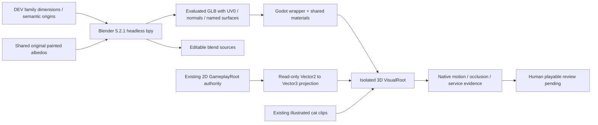

# WILLICAT HYBRID 3D ASSET PIPELINE V1

Status: implemented isolated DEV kit; human Hybrid direction accepted, kit playable visual review pending. No production migration or Factory publication approval.

## Authorities and boundaries

| Authority | Role |
|---|---|
| Existing continuous Café GameplayRoot | Absolute Vector2 layout, footprints, interaction/service anchors, navigation, IDs and gameplay state |
| Human Reference B: `ChatGPT Image Oct 1, 2026, 08_34_49 PM.png` | Visible cedar/plaster, recesses, sage panels, bevel/material/light response; not coordinates, stairs or second floor |
| [Style Calibration](../art_direction/WILLICAT_STYLE_FAMILY_CALIBRATION_V1.md) | Japanese Riverside Storybook palette/material/projection grammar; canonical orange identity remains separate |
| Previous Hybrid | Reusable projection/navigation/sprite bridge; primitive meshes are replaced only in this isolated DEV presentation |

The human preference for LIVE HYBRID in motion governs this slice. The approved recovered 2D Café remains intact and remains the established production baseline. No Factory frozen profile, approval credential or production-ready derivation is modified.



## Phase 0 and Phase 1

Blender `/Applications/Blender.app/Contents/MacOS/Blender`, **5.2.1 LTS**, build `9e2066aef7ef`, executed background `bpy`, saved `.blend`, exported GLB and imported into Godot **4.7.2**. The tiny table calibration ran before full-kit generation: bevel, normals, UV/materials, semantic floor origin, axis conversion, dimensions, native render and explicit collision separation. Ten checks passed; delivered original calibration is separate from the 27-piece family. Its `0.02m` import sanity margin is a DEV diagnostic choice, never a new world or production tolerance.

## Coordinate, registration and scale contract

| Concept | Contract |
|---|---|
| Blender | Metric unit scale 1; XY floor, Z up, forward -Y |
| Godot | XZ floor, Y up, forward +Z; one imported unit equals one authoring unit |
| Export | glTF `export_yup=True` performs axis conversion; no arbitrary import correction rotations |
| Gameplay projection | `Vector2(x,y)` → `Vector3(x*0.01, elevation, y*0.01)`; reversible, no new navigation |
| Orientation | Intentional chair/side-wall rotations are object-facing choices; family roots remain identity |
| Root | Semantic origin, never automatic bounding-box center |
| Geometry | Horizontal envelope/contact placement reads existing footprints. Heights are explicit DEV art parameters judged against original cat; not new gameplay measurements |

Ground props/table/chair/counter use contact center. Walls/beams use structural left anchor. Window uses lower-left wall insertion. Shelf uses left mounting endpoint. Lamps use attachment point. Entrance uses authoritative aperture center. Local child offsets accommodate existing root versus footprint-center differences; GameplayRoot does not move.

Measured Café envelope is 640 × 1024 logical units (6.4 × 10.24 visual units). Front opening is x288…352: 64 logical units / 0.64 visual units. Rear garden opening is x480…544. The 640×1000 approved 2D display presentation is not silently substituted for the physical envelope. Root/footprint/anchor projection is recorded in `kit_manifest.json`; its canonical projection SHA256 binds asset-relevant data. Historical scene files remain byte-identical.

Wall family 1.6-wide default modules is a **DEV authored module parameter**, not invented canonical gameplay grid. Last spans are fitted to the measured existing walls; cutaway side/front heights are presentation decisions. Door posts remain outside the real opening; rear shelving ends before the garden opening. Solid cabinet legs/posts stay inside their authoring width/depth; pastry support is stretched to its existing 88×32 footprint. Countertops/tabletops may overhang above ground without creating new collision. No traversable gap is filled by an opaque new cabinet.

## Builders and export/source separation

`tools/willicat_hybrid_cafe_kit/blender_build.py` contains practical wall, beam, window, open entrance, counter, round table, chair, shelf, planter, lamp, ceramic, service equipment and floor builders. Width/depth/height/bevel/panel/trim inputs are deterministic authored parameters, not a random geometry framework.

| Family | Count | Assets |
| architecture | 9 | Wall_Cream_A, Wall_Window_A, Beam_Cedar_A, Post_Cedar_A, Window_Recess_A, Window_Sill_A, Entrance_Open_A, Trim_Cedar_A, Floor_Section_A |
| counter | 3 | Counter_Straight_A, Counter_End_A, Counter_Short_A |
| service | 4 | Espresso_A, Grinder_A, POS_A, Cup_Saucer_A |
| furniture | 2 | Table_Round_A, Chair_A |
| decor | 9 | Shelf_A, Shelf_Short_A, Planter_Floor_A, Planter_Table_A, Ceramic_Jar_A, Lamp_Hanging_A, Lamp_Wall_A, Sign_Blank_A, Cat_Cushion_A |

Editable individual `.blend` files keep part names, bevel/normal modifiers and packed original textures. `WC_CAFE_Shared_Materials.blend` is a reusable material source; `WC_CAFE_Kit_Catalog.blend` is an editable catalogue scene, not exported gameplay content. Runtime GLBs exclude catalogue lights/cameras/helpers. The export working scene applies modifiers and joins mesh parts by asset to reduce node count, preserving semantic root, named material surfaces and UV0.

### Normals and UV

Soft authored bevels use two segments and weighted normals; planar panels remain flat, curved pottery/pedestals smooth. Lathe axis caps use triangle fans rather than repeated zero-radius vertices. UV0 uses local projected painted axes with one uniform UV layer name before mesh joining. A discovered `UVMap`/`UV0` mismatch collapsed table coordinates during join despite UV-count checks passing; it was fixed and each painted exported surface now has noncollapsed two-dimensional UV coverage validation. This is in addition to counts, normals, imported bounds and triangle parity.

UV0 is reusable painted material mapping, not a lightmap. UV2 is intentionally un-authored: a later LightmapGI experiment must generate nonoverlapping UV2 on evaluated exported geometry through Godot Advanced Import and validate it. No bake is claimed here.

## Shared materials and textures

15 shared `WC_MAT_*` resources: Cedar Light/Mid/Dark; Plaster Cream; Sage Fabric; Ceramic Offwhite; Charcoal Trim; Restrained Metal; Foliage/Light/Dark; Coffee; Paper Warm; Indigo; Lantern Paper. Wrappers map GLB material semantic names to shared `.tres` resources instead of one copy per object. Metal response is restrained, zero metallic and disabled specular in Godot; roughness .94 general / .84 ceramic / .82 metal. These are authored DEV material choices, not calibration tolerances. Lantern emission is small and local.

Five **unchanged** 512×512 first-party painted albedos are reused from the prior fidelity spike. Cedar was previously text-only generated; four others original procedural work. No photographic/third-party pixels, new image generation or protagonist art were used in this task. Original provenance is retained under the new kit texture record. Five RGBA8 maps require about 5 MiB uncompressed before mipmaps (~6.67 MiB with a complete mip chain); actual runtime allocation includes many retained gameplay/GLB/avatar resources and is measured separately. Embedded GLB materials ensure basic import portability, but wrappers define the intended shared runtime material response; do not distribute raw GLBs as a complete look without the material handoff.

## Godot import, collision and gameplay bridge

27 wrappers under `scenes/dev/hybrid_cafe_kit/prefabs/` bind shared materials, semantic origin and DEV scope. GLBs contain no automatic CollisionObject3D/trimesh or navigation. Existing simple 2D PhysicalFootprint/CollisionShape2D and established navigation remain authoritative; this avoids two conflicting physics worlds. The hidden original world still runs customer/service/Focus/economy/save semantics in an isolated save namespace.

`cafe_kit_3d.gd` composes the family at existing object roots and projects the original orange actor, worker and active customer. AnimatedSprite3D uses the exact existing SpriteFrames, upright camera-facing presentation, subtle ambient tint and alpha depth prepass. Camera vertical compensation preserves artwork screen proportions; separate contact sprites ground feet. Geometry depth tests handle counter/table/chair front/back; no 2D occluder swapping is used.

Fixed orthographic portrait camera, KEEP_WIDTH 8.05, elevated 3/4. No free rotation or dramatic perspective. One soft key (.68), cream ambient fill (.57), one restrained local practical (.25, no shadow); only key casts shadows. Four-sample MSAA. No SSAO, LightmapGI, bloom, heavy vignette, fog or DOF. Catalogue uses separate neutral Blender studio lighting and is labelled accordingly.

## Isolated operation / reproduction

Open `tools/willicat_hybrid_cafe_kit/Open_Hybrid_Cafe_Kit.command`, or run `python3 tools/willicat_hybrid_cafe_kit/run.py`. Launcher reuses the existing Forge Python environment if Pillow/NumPy are absent. It verifies the 164-file human-approved Café binding, builds a fresh `/private/tmp` project, imports GLBs and opens the isolated scene. Save namespace: `WilliCatHybridCafeKitDEVV1`. Click the floor to walk; use Depth Walk and Make Coffee. Baseline button shows the intact 2D source for comparison.

Existing/temp/protected/traversal/symlink destinations are refused; kit intake refuses symlinks. No publisher capability is present. DEV path safety does not constitute authenticated production approval. Blender build command (explicit output only):

```sh
/Applications/Blender.app/Contents/MacOS/Blender --background \
  --python tools/willicat_hybrid_cafe_kit/blender_build.py -- \
  --out /private/tmp/willicat_cafe_kit_rebuild \
  --textures assets/dev_review/stylized_fidelity_v1
```

A builder output is not automatically installed or published. Source hashes, exact GLB/source files, Blender/Godot versions and recipe hashes are recorded. Geometry intent is reproducible; byte-identical Blender save/export encodings across environments are not promised. Import cache is temporary, not source-of-truth evidence.

## Validation and next boundary

Delivered diagnostics: native kit/depth/service checks, Blender–Godot calibration, four-layer pixel depth analysis, steady native profile, launch safety, existing gameplay regressions and pre-task protected-byte parity. Agent self-QA is separate from human kit approval. Moving evidence is mandatory.

The next permitted step is **human playable review of this isolated kit**. If accepted, separately authorize mobile profiling/optimization and a limited production integration plan. No production Home migration, source-rights gate bypass or replacement of Factory human approval is authorized by this DEV result.

Official import reference: [Godot 4.7 importing 3D scenes](https://docs.godotengine.org/en/4.7/tutorials/assets_pipeline/importing_3d_scenes/index.html). Blender behavior/version in this document comes from executed local `bpy`/GLB tests.
