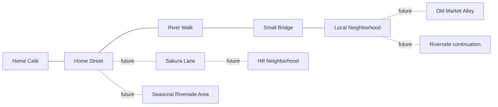

# WILLICAT RIVERSIDE HOME DISTRICT DESIGN V1

Date: 2026-10-02. **PROPOSED — READY FOR HUMAN WORLD-DESIGN REVIEW.**

This packet designs a future **real Stylized 3D Storybook Diorama**. Its PNGs are raster concept targets depicting dimensional assets, not meshes, pre-rendered production sprites, measured templates or a playable scene. Existing Home coordinates, navigation, gameplay anchors, save IDs, approved café and Tree Pilot remain authority and unchanged. Human acceptance of these concepts does not authorize migration or production publication.

## 1. Authorities and evidence

- [Research synthesis and primary sources](../research/WILLICAT_RIVERSIDE_WORLD_VISUAL_RESEARCH_V1.md): written before image generation; facts are separated from design interpretation.
- [Style Calibration V1](WILLICAT_STYLE_FAMILY_CALIBRATION_V1.md) and [exact style record](../asset_factory/style_families/WILLICAT_JAPANESE_RIVERSIDE_STORYBOOK_V1.json): cedar/cream/sage/moss/water/material/projection language. Historic record remains 2D runtime/MVP-input approval; this task separately authorizes stylized-3D exterior design exploration.
- [Approved café human decision](../production/WILLICAT_CAFE_VISUAL_FIDELITY_RECOVERY_V1_HUMAN_REVIEW_DECISION.md): quality baseline, not a reason to rebuild its interior.
- [Existing Riverside playable result](../production/WILLICAT_RIVERSIDE_FOCUS_PLAYABLE_V1_RESULT.md): existing spatial/gameplay context.
- First-party outdoor/town reference boards in `docs/references/style/willicat_japanese_riverside_storybook_v1/` were viewed. Their material mood informs the text brief; tourist motifs, perspective convergence and dense blossom dressing are not layout authority.

No third-party photo or game screenshot was fed into generation. Inputs were original text descriptions; two controlled edits used this task's own generated C/Master images. No provider-specific proprietary layouts or character designs were reproduced intentionally. Generation provenance is recorded; this is not a new legal clearance decision or authenticated production approval.

## 2. Three independent candidates

All four district views use the same requested portrait, elevated 3/4, near-orthographic, soft-isometric-lite miniature camera family. Native generator outputs are **941×1672**, approximately 9:16 with pixel rounding; originals are preserved. Exact 9:16 review frames contain them without cropping. Still-image camera similarity is qualitative, not measured azimuth/elevation/projection parity.

| Candidate / image | Actual visible strength | Actual limitation | Master contribution |
|---|---|---|---|
| [A — Home Riverside Lane](../../artifacts/world_design/riverside_home_district_v1/RIVERSIDE_HOME_LANE_CONCEPT_A.png) | Café beside a short lane and close water edge; strong domestic frontage | Dense planted edges; bridge's far approach approaches image boundary; repeated corridor | Single-story home frontage, calm lane, compact entry |
| [B — Riverside Bend](../../artifacts/world_design/riverside_home_district_v1/RIVERSIDE_BEND_CONCEPT_B.png) | Curved water and bridge create a discoverable landscape landmark | Water dominates; café grew to two stories; deeper hill vista weakens gameplay-camera intimacy | Gentle bend and bridge reveal only; reject oversized water/café mass |
| [C — Neighborhood Waterway](../../artifacts/world_design/riverside_home_district_v1/NEIGHBORHOOD_WATERWAY_CONCEPT_C.png) | Crossing and multiple side paths connect residential/commercial frontage; bicycle detail suggests everyday use | Architecture remains mostly older; café is taller than the desired Master; tiny frontage detail competes | Neighbor paths, frontage variety, both crossing approaches |

C initially had shallow foreground blur. A controlled tool edit made the foreground legible. The initial image remains in the generator output folder and is identified as superseded in the receipt. No shallow foreground DOF is used as a Master design solution.

## 3. Synthesized Master

[WILLICAT_RIVERSIDE_HOME_DISTRICT_MASTER_CONCEPT_V1](../../artifacts/world_design/riverside_home_district_v1/WILLICAT_RIVERSIDE_HOME_DISTRICT_MASTER_CONCEPT_V1.png)

The Master was generated from a new combined spatial brief; none of A/B/C was selected unchanged. A subsequent controlled edit thinned bank/paving vegetation, simplified one rear residence and quieted water markings while retaining its composition.

| Depth band | Actual design contents | Readability / ownership |
|---|---|---|
| Foreground | Accessible stone lane, short steps, bench/lamp pocket, low foliage frame | Calm route center; small details outside walking strip; future walkability/elevation requires authoritative template review |
| Midground | Single-story café, visible open threshold, river bend, compact bridge, far-bank storefront/residence | Café entrance first, bridge second, branching paths third; both bridge approaches shown |
| Background | Quieter upper houses, tree masses and low hill continuation | Atmospheric value grouping through painted colors; proposed noninteractive continuation, not a fully playable distant town |

Proposed experience: **Home Café → Home Street → River Walk → Small Bridge → Local Neighborhood → future routes**. Lane continues upward behind the café; bridge crosses to a far-bank path. A foreground route continues beyond the current frame. These are visual connection suggestions, not final level geometry. Exits have not been assigned exact in-scene destinations.

The original continuous Home graph remains Café ↔ Riverside, Plaza below, Garden above. This district concept does not reposition or reinterpret it. A future authorized implementation must reconcile approved conceptual connections with that authority; it cannot move the world simply to match this PNG.

## 4. Original exterior grammar

| Dimension | Proposed WilliCat rule |
|---|---|
| Silhouette | Modest building masses, softened cedar frame, thick sill/threshold, calm low bridge; no castle roofs or exaggerated arches |
| Proportion | Miniature but usable-looking openings; café stays a domestic landmark, neighbor fronts subordinate; dimensions/actor-to-object world scale UNMEASURED |
| Palette | Existing cedar/cream/sage/moss/warm stone/blue-green water anchors; muted jade optional relationship, not an Art Deco requirement |
| Painted surfaces | Broad matte albedo variation and selective recess darkening; low-contrast grain; clean weathering; no photographic textures or shiny varnish |
| Light | Soft neutral daylight, restrained practical warmth, gentle grounding; no cinematic golden wash or bloom |
| Everyday identity | One modest utility detail, pots and small work/bench clusters; varied old/new plaster treatments; not a pristine historical museum |
| Original motifs | Rounded ceramic rim, paired foliage masses, shared cedar rail terminal/profile; proposed double-notch terminal motif requires later silhouette resolution |
| Detail frequency | Large material masses carry identity at gameplay scale; fine joints and leaves are decoration only |

The generated plates do **not** consistently author the proposed double-notch detail; do not claim it is resolved. The shared broad cap/rail rhythm is the reliable current family cue. No generated readable brand text is an approved runtime texture.

## 5. Reusable asset-family design rules

[WILLICAT_RIVERSIDE_ASSET_FAMILY_BOARD_V1](../../artifacts/world_design/riverside_home_district_v1/WILLICAT_RIVERSIDE_ASSET_FAMILY_BOARD_V1.png) shows seven grouped families. The following rules clarify intent where a generated image alone is ambiguous. All are **PROPOSED visual design rules**, not hardened schema amendments.

| Family / intended pieces | Silhouette and proportion | Materials / stylization | Gameplay readability | Modular connection intent |
|---|---|---|---|---|
| Architecture: café, neighbor storefront, residence, roof, wall/timber, window/sill, door, awning, blank signage | Single-story café landmark; modest varied neighbor mass; broad eave and recessed openings | Shared cedar/cream/charcoal roof; sage accents selective; soft profiles, quiet utility infill | Open door framed by jamb/sill/threshold; blank signage separate from symbols/text | Shared wall footing, corner post, eave, sill and door interfaces; roof/wall contacts matched; canopy attaches to authored frame; no opaque exterior pretending to be an interior |
| River: water, embankment, cap/end, stairs, drain, railing, corners | Clear water ribbon and continuous walk-side cap; distinct concave/convex corners; small stair recess | Warm gray stone, quiet mortar, sparse lower moss, blue-green water | Cap separates travel surface and water; steps/drain are recognizable but access semantics unresolved | Straight/inside/outside/terminal pieces share cap section, bank top/base and water-level reference; stairs need end/side contacts; all values UNMEASURED |
| Bridge: deck, rail, support/abutment, approaches | Broad low deck, slight camber at most, readable lateral volume; no large decorative arch | Cedar with restrained dark fasteners; shared stone at both approaches | Both landings visible; rail rhythm quieter than route; no post across opening | Deck-to-abutment-to-approach alignment and rail terminals share registration; span, clearance and collision not inferred from concept |
| Ground: warm stone, compact street, edge transition, steps, curbs | Curved routes through broad calm surfaces; steps localized | Low-contrast stone/packed surface variation; restrained seams | Surface/curb changes clarify route; no arbitrary noisy blocks or repeated flower dots | Inside/outside/straight edge vocabulary, threshold-to-door and cap-to-bank joins; art dimensions separate from logical placement cell; complete adjacency set not established |
| Vegetation: small river tree, medium neighborhood tree, airy upright tree, shrubs, grasses, moss, pots, bank planting | Different age/branch/canopy rhythms, not scaled duplicates; rooted contact; mass separation | Sage/moss/deeper green groups, cream ceramics, broad painterly leaves | Canopy framing outside entry/crossing; near route trunks visible; grass not a walking obstacle cue | Root/ground anchor and separate shadow/depth roles; planting strips meet bank recesses; canopy masks/LOD/profile values future work |
| Street props: bench, small lamp, bicycle parking, crate/basket, planter, utility box | Few compact functional clusters; thick legible edges | Cedar/ceramic/dark trim/quiet brass; no red-lantern festival | Bench is a landmark; tiny props cannot independently signal interactability at current scale | Prop contact/footprint and interaction anchors from world authority later; utility attachment belongs to wall; bicycle storage stays outside routes |
| Background: distant house group, hill, tree mass | Broad low-contrast silhouettes; sparse roof rhythm | Same family, quieter contrast/saturation by distance | No foreground-like detail or implied reachable landmark without scope approval | Group boundaries and camera coverage reviewed later; background representation/mesh vs billboard remains open, no collision/nav authored here |

Family board has all required vocabulary visually, but it is not a complete mechanically interchangeable library. Generated bridge camber/profile and façade details vary among plates. For future construction, the corresponding hero study guides visual design; measured world/template registration has higher authority than every plate. Exact connectors, pivots, dimensions, navigation clearances, tile spans and tolerances remain **UNMEASURED** until separately authorized extraction/calibration.

## 6. Five hero asset studies

| Exact image | Study intent | Unresolved before any production asset |
|---|---|---|
| [WILLiCAT_RIVERSIDE_SMALL_BRIDGE_V1](../../artifacts/world_design/riverside_home_district_v1/WILLiCAT_RIVERSIDE_SMALL_BRIDGE_V1.png) | Near-flat deck thickness, side plane, low rail module, stone abutment/approach | Real span, grade, rail attachment and collision; tiny fasteners decorative; no structural safety certification |
| [WILLiCAT_RIVER_EDGE_KIT_V1](../../artifacts/world_design/riverside_home_district_v1/WILLiCAT_RIVER_EDGE_KIT_V1.png) | Assembled sample plus straight/concave/convex/end/transition/stair/drain/rail/water/planting studies | Bank/water elevation and adjacency/parity; pictured drain stream is illustrative, not an approved always-on FX requirement |
| [WILLiCAT_NEIGHBOR_STOREFRONT_V1](../../artifacts/world_design/riverside_home_district_v1/WILLiCAT_NEIGHBOR_STOREFRONT_V1.png) | Recessed frontage, blank sign, utility attachment, window/door/awning components | Miniature façade variants differ less than requested; neighborhood needs one clearly quieter newer frontage later; shop function remains open |
| [WILLiCAT_RIVERSIDE_TREE_FAMILY_V1](../../artifacts/world_design/riverside_home_district_v1/WILLiCAT_RIVERSIDE_TREE_FAMILY_V1.png) | Three different canopy/trunk silhouettes, ground contact and foliage-led motion idea | Leaf detail is too fine for distant use; large center tree is a silhouette reference, not locked size; no animation or family calibration measured |
| [WILLiCAT_HOME_CAFE_EXTERIOR_LANGUAGE_V1](../../artifacts/world_design/riverside_home_district_v1/WILLiCAT_HOME_CAFE_EXTERIOR_LANGUAGE_V1.png) | Café framing, open threshold, deep sill, matching wall/window/door/awning modules | Extra visible interior is mood only; existing approved café remains unchanged; shell/aperture registration must derive from authoritative geometry |

## 7. Mobile-size design assessment

Evidence: [360×640](../../artifacts/world_design/riverside_home_district_v1/MASTER_MOBILE_360x640.png), [540×960](../../artifacts/world_design/riverside_home_district_v1/MASTER_MOBILE_540x960.png), and [read-only review viewer](../../artifacts/world_design/riverside_home_district_v1/REVIEW.html). Browser captures record [café](../../artifacts/world_design/riverside_home_district_v1/MOBILE_REVIEW_EXISTING_ACTOR_CAFE.png), [bridge](../../artifacts/world_design/riverside_home_district_v1/MOBILE_REVIEW_EXISTING_ACTOR_BRIDGE.png), [lane](../../artifacts/world_design/riverside_home_district_v1/MOBILE_REVIEW_EXISTING_ACTOR_LANE.png).

The viewer uses an exact copy of existing `orange_down.png`, its first 256×256 idle cell as authored by the current character adapter, with a 40/60 px display canvas. Those display sizes and placements are **uncalibrated review assumptions**, not Home measurements. The source sheet and generated concepts are unchanged. Static overlay is always composited above the image: no movement, 3D grounding or depth correctness can be concluded.

| Feature | Observed at 360×640 / 540×960 | Design response / remaining verification |
|---|---|---|
| Protagonist | Existing orange/cream silhouette separates from stone lane and blue-green bridge background at both hypothetical sizes; facial detail weaker at smaller size | Preserve identity; actual runtime scale/occlusion/moving-character review required later, not passed here |
| Café entrance | Open dark aperture, sage awning and framed jamb remain distinguishable; plant clutter reduced | Keep entry pots off threshold; exact walkable/visual aperture parity unmeasured |
| Bridge | Cedar deck/rails and both approach areas read as the crossing | Candidate clear landmark; rail/canopy masking during actual movement not proven |
| Primary path | Calm continuous center strip leads toward café/bridge; localized foreground steps remain visible | Fine stone joints cannot define nav or interaction; grades/clearances not validated |
| District exits | Upper lane and far-bank continuation visible; edges suggest more world | Destination names not obvious from art alone; route identity/semantic feedback deferred, not falsely marked fully readable |
| Interactive props | Bench silhouette visible; small lamp/pots recognized as décor, not reliable affordances | Only selected large prop should become interactable with separately designed state feedback; reduce tiny utility/leaf details in future mesh/material work |

Master refinement removes many creeping plants and quiets water speckle to protect path clarity. Hero plates intentionally retain close-up information; leaf tips, fasteners and miniature grain must be simplified or omitted where invisible, not blindly modeled. No target phone, touch size, draw call, triangle budget or beauty score is invented.

## 8. Living details — proposal only

| Detail | Candidate mechanism | Anchoring and quality rule |
|---|---|---|
| Quiet current | Shared shader UV/color flow | Flow follows bend; broad restrained marks, no noisy sparkles |
| Tree canopy | Masked vertex animation; authored small skeletal branches if shape demands | Root/trunk/base fixed; foliage-led arcs; no whole-sprite/whole-mesh scale pulse; technical animator approval |
| Grass tips | Masked vertex displacement | Base lock, localized phase variation; sparse banks only |
| Hanging small sign | Pivoted transform animation | Bracket fixed; no signage collision meaning; motion amplitude uncalibrated |
| Occasional leaf / ripple | Sparse particles / event-driven one-shot | Cozy cadence; no continuous reward/combat spectacle |
| Awning edge | Vertex mask | Wall/beam contacts fixed; modest tip response only |

No animations, shaders, particles or skeletons are implemented. Amplitude, timing, phase spread and performance limits are **UNMEASURED / CANDIDATE_REQUIRES_CALIBRATION**. Measured motion and human motion acceptance remain separate future gates.

## 9. Conceptual world map

[WILLICAT_RIVERSIDE_CONCEPTUAL_WORLD_MAP_V1.svg](../../artifacts/world_design/riverside_home_district_v1/WILLICAT_RIVERSIDE_CONCEPTUAL_WORLD_MAP_V1.svg) provides expansion logic, not final geography.

Sakura is a later restrained seasonal lane, not permission to cover Home in blossom trees. Distances, true north, elevation and loading/streaming boundaries are unspecified. Existing Plaza/Garden are retained in current Home authority; this map adds no implemented connection or removes any existing one.

## 10. Agent self-QA and handoff limits

**Completed:** research-before-generation; three distinct hypotheses; genuine synthesized Master; foreground-focus correction; planted-edge/water simplification; seven-family board; five studies; topology map; two mobile preview sizes with unchanged existing actor; input/output hashes and exact prompts; local link/image/JSON inspection.

**Not performed:** mesh generation, Godot world implementation, navigation, collision, runtime import, moving-character/depth proof, phone profiling, family calibration, rights clearance for production, authenticated human approval. No production files are changed and no commit/push occurs.

Generated concepts are approximations: some edge profiles do not match between views, camera is not mathematically verified, older architecture still dominates, bridge's far approach is near the frame edge, and some tree/detail density needs future reduction. These are exposed for review, not silently declared technical PASS.

### Human decisions still open

1. Accept the Master's intimacy and water/route balance, or prefer a less linear lane?
2. How much clearly newer ordinary frontage belongs beside timber/plaster neighbors?
3. Accept near-flat bridge and calm low-rail language; resolve the optional original terminal motif?
4. Is current foliage density sufficiently quiet after refinement? Choose distinct tree silhouettes, not locked world sizes.
5. What everyday neighbor function fits Home: ceramics, bread, or another small service?
6. Which exit should lead to which future district, consistent with existing Home authority?
7. Are small interactive props needed, or should the first future district slice focus only on café/bridge/bench?

The next permitted step is human world-design review. Any accepted design then needs separately authorized template/world reconciliation and an isolated moving-actor proof before production integration. **No production implementation begins until human approval.**

**READY FOR HUMAN WORLD-DESIGN REVIEW**
