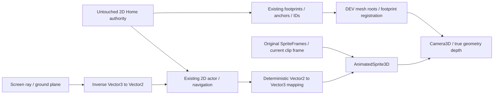

# WilliCat Hybrid 3D Diorama Research V1

## 1. Decision and scope

**D. MORE RESEARCH REQUIRED.** The completed experiment proves deterministic 2D-to-3D presentation, real geometry occlusion, existing cat clip reuse, portrait picking and two desktop rendering backends. It does **not** yet prove that hybrid rendering delivers a better premium storybook presentation than the approved 2D café, or that it meets phone cost requirements.

**Agent visual assessment: B — acceptable but requires refinement.** The cat remains charming/readable; the environment is materially simpler, less painterly and less intimate than the approved 2D family. True volume solves depth relationships; it does not automatically solve material language, detail hierarchy or richness. This assessment is self-QA, not human approval.

Research date: 2026-10-01. Installed/tested: Godot **4.7.2**, official `ed1daf0bf001b61586d9930840f2f1394092c079`. Sources below use official **4.7** documentation. Evidence labels: DOCUMENTED = cited capability; MEASURED = native proof/metrics; OBSERVED = visible render; PROPOSED = future workflow; UNTESTED = no experimental claim.

The approved café, tree, style calibration and Factory contracts remain unchanged. The earlier premium 2D polish task was interrupted and left in temporary staging; it is not presented as complete by this spike.

## 2. Terminology

| Term | Meaning here |
|---|---|
| Current 2D / 2.5D | 2D world and sprites; illustrated elevation, Y-sort and authored front layers simulate depth. |
| Pre-rendered 3D → 2D | Meshes are an authoring source; fixed views become registered raster assets, with the existing 2D runtime. |
| Hybrid | Real 3D environment meshes and Camera3D; an illustrated AnimatedSprite3D follows an authoritative 2D actor. |
| Orthographic | Parallel projection; distance does not change apparent object scale. |
| Diorama | Small composed miniature; not a free-rotation simulator or full town conversion. |
| Billboard | Camera-facing sprite plane, with depth testing retained. It is still a plane, not a 3D cat. |
| Gameplay authority / visual projection | Original Vector2 world controls IDs, collision/nav, slots/actions and saves; Vector3 representation follows it. |

The style calibration's approved **2D runtime** designation remains frozen. This human-authorized DEV research explores a different runtime while retaining its material/palette/illustration vocabulary; it does not silently promote a 3D style revision.

## 3. Market/reference observations

The supplied promotional screenshots show readable volume, grouped foliage, strong object grounding, separated foreground/background and localized interaction emphasis. These are visual observations, not evidence of an engine, projection type, bake system or asset production process. The official [Heroes of History listing](https://play.google.com/store/apps/details?hl=en&id=com.innogames.heroesofhistory) and [Plants on Fire listing](https://play.google.com/store/apps/details?id=com.plantsonfire.merge) establish the products, not their internal pipelines.

Rise of Cultures and Sunrise Village are named reference candidates; their internal rendering/production systems were not established here. No competitor assets were downloaded, copied, conditioned into generation or used as scene textures. No proprietary layout/composition was reproduced.

## 4. Godot 4.7 capability findings

| Topic | DOCUMENTED capability / limitation | Experiment / proposed use |
|---|---|---|
| Camera3D | Orthogonal projection, aspect control and screen ray projection. [Camera3D](https://docs.godotengine.org/en/4.7/classes/class_camera3d.html) | MEASURED: fixed orthographic, KEEP_WIDTH, portrait 504×896. Ground-plane picking inverse-tested. Mild perspective was unnecessary and not tested. |
| Low-complexity environment | Mesh/material reuse, batching/instancing and culling are practical cost controls. [3D optimization](https://docs.godotengine.org/en/4.7/tutorials/performance/optimizing_3d_performance.html) | MEASURED: scripted bevels, rods, cylinders, leaves and static per-object/material batches. No runtime CSG. |
| Existing cat animation | AnimatedSprite3D consumes SpriteFrames. [AnimatedSprite3D](https://docs.godotengine.org/en/4.7/classes/class_animatedsprite3d.html) | MEASURED: identical existing SpriteFrames object; clip/frame/progress follow the original AnimatedSprite2D. No new cat pixels or clips. |
| Transparency | Alpha blending can sort poorly; discard, opaque prepass and hash are alternatives. [SpriteBase3D](https://docs.godotengine.org/en/4.7/classes/class_spritebase3d.html) | MEASURED: blending, discard and opaque prepass previews; final prepass retains smoother edges and passes depth cases. Single-cat proof does not establish crowd sorting. |
| Billboard | Camera-facing and fixed-Y behavior exist; billboard shadow facing can be ambiguous with multiple cameras. [SpriteBase3D](https://docs.godotengine.org/en/4.7/classes/class_spritebase3d.html) | MEASURED: camera-facing, upright fixed-Y and fixed-facing previews. Final camera-facing, depth enabled, sprite cast shadows OFF, floor contact sprite separate. |
| Baked lighting | Static geometry needs UV2; dynamic objects can receive probe lighting; bake modes affect whether lights remain dynamic. [LightmapGI guide](https://docs.godotengine.org/en/4.7/tutorials/3d/global_illumination/using_lightmap_gi.html) | UNTESTED: no bake. PROPOSED: bake fixed architectural modules; retain dynamic key/contact for movable props. Renovation requires bake invalidation and probe review. |
| Mobile/backend | Mobile uses RenderingDevice; web uses Compatibility. Baked lightmap sampling works in Compatibility, with baking requiring suitable hardware. [Renderers](https://docs.godotengine.org/en/4.7/tutorials/rendering/renderers.html) | MEASURED: Mobile/Metal and Compatibility/OpenGL on M2 Pro. No phone build or WebView/web export. |
| Matte materials | Roughness, specular modes, vertex/albedo color and texture controls are configurable. [Materials](https://docs.godotengine.org/en/4.7/tutorials/3d/standard_material_3d.html) | MEASURED: roughness .95/.96, metallic 0, specular disabled, existing painted textures; no normal/ORM/clearcoat/reflection maps. These are DEV settings, not calibrated material specifications. |
| Soft shadows | Shadow filtering/blur trade softness against grain/cost. [Lights/shadows](https://docs.godotengine.org/en/4.7/tutorials/3d/lights_and_shadows.html) | MEASURED: one shadowed directional key, filtered shadow blur; one non-shadowed practical. No cinematic beams or screen glow. |
| Ambient occlusion | Mobile has no SSAO; current 4.7 Compatibility/Forward+ support differs. Directional PCSS is unavailable on Mobile. [Renderers](https://docs.godotengine.org/en/4.7/tutorials/rendering/renderers.html) | SSAO OFF in both tests. PROPOSED: vertex/contact shading, baked AO or lightmap for static corners. PCF-style filtering and cat blob contact are the portable experiment. |
| Foliage | Many transparent layers increase fill/sorting cost; MultiMesh groups share culling bounds. [Optimization](https://docs.godotengine.org/en/4.7/tutorials/performance/optimizing_3d_performance.html), [MultiMesh](https://docs.godotengine.org/en/4.7/classes/class_multimesh.html) | MEASURED: one planter uses opaque leaf volumes. PROPOSED: modest layered opaque/scissor leaves, limited vertex wind, species silhouettes; tree conversion UNTESTED. |
| Water | Simple meshes/materials are available; backend features differ. | PROPOSED: matte blue-green plane, local ripple mesh/texture and bank volumes; no refraction/full-screen distortion. No river was converted or water shader tested. |
| Draw/light/transparency cost | Shared resources help, but light/shadow and transparent passes still cost work. [Optimization](https://docs.godotengine.org/en/4.7/tutorials/performance/optimizing_3d_performance.html) | MEASURED: 35 environment meshes, 12 materials, 2 sprite planes, 2 realtime lights; enabling the shadowed key changes 43 → 78 draw indicators. |
| Touch coordinates | Camera rays can intersect a ground plane. [Camera3D](https://docs.godotengine.org/en/4.7/classes/class_camera3d.html) | MEASURED: projection/pick inverse test. Mouse and InputEventScreenTouch handled; real-device touch UX UNTESTED. |
| Existing world mapping | Project-specific architecture, not an engine promise. | MEASURED: `(x,y) → (.01x, elevation, .01y)`; inverse divides X/Z by .01. Scale is a reversible DEV unit choice; no Home measurements invented. |

## 5. Pipeline comparison

B is researched, not prototyped. C observations apply to this tiny spike, not a complete town.

| Criterion | A — current 2D/2.5D | B — pre-rendered 3D → 2D | C — hybrid environment + 2D cats |
|---|---|---|---|
| Visual depth | Approved illustration; authored occluders/Y-sort | Consistent rendered planes, still runtime layer grammar | Actual volumes/Z-buffer proved; painterly finish still weaker |
| Family consistency | Current approved family exists | Shared model/material source may improve consistency | Shared materials/modules possible; calibration still needed |
| Runtime lighting | Local overlays and authored shading | Mostly baked in raster; runtime overlays remain | True mesh lighting/shadows proved; sprite remains unlit |
| Cat reuse | Existing clips unchanged | Existing clips unchanged | Existing clips/frame map reused; sprite-facing/depth need tests |
| Gameplay reuse | Native current authority | Native current authority | Existing 2D nav/IDs/actions preserved in spike |
| Tooling | Current Forge/Factory contracts | Adds modelling/render camera/export registration | Adds meshes/UVs/renderer/material/bake validation |
| AI-assisted source | Raster templates and frame grammar | Geometry plus camera-controlled render templates | Geometry-first modular source; generated meshes need cleanup |
| Phone performance | Existing cost envelope, still needs devices | Similar runtime class; larger directional sheets possible | Light/shadow/alpha/material cost needs device proof |
| Memory | Existing raster/sheet footprint | View/state/season exports can multiply textures | Mesh/material/shadow buffers plus cat textures; not inherently smaller |
| Draw calls | Canvas batches and layers | Similar canvas costs | Batched mesh surfaces plus shadows; measured in result |
| Development difficulty | Lowest migration risk | Moderate authoring change | Highest integration/calibration cost of these three |
| Renovation | Registered raster variants and slots | Re-render variants; preserve runtime footprint | Movable modules natural, but collision parity/bakes need invalidation |
| Future town | Existing continuous world/template grammar | Fixed-view libraries can expand | 3D culling/streaming/LOD needed beyond this small scene |
| Seasons | Texture/sprite families | Rendered seasonal families can proliferate | Material/foliage variants possible; no season system proved |
| Production risk | Known approved baseline | New authoring pipeline; runtime remains known | Unproven phone, palette/backend parity and 3D registration profiles |

Full 3D cats are a future alternative only; they would require new rigging, identity, animation and review evidence and were not tested or recommended here.

## 6. Prototype architecture

Root: `WilliCatHybridCafeDEV` (Node3D). Children: hidden `GameplayAuthority2D` (original recovered scene), `DioramaVisualRoot` (semantic object groups/material batches), fixed `Camera3D`, `WorldEnvironment`, directional key, existing cat AnimatedSprite3D, floor-contact Sprite3D and DEV controls. One OmniLight sits under the lamp. There is **no CharacterBody3D, 3D navigation, 3D collision authority or second save/economy model**.

Meshes attach to the original counter/table/two chair/plant IDs. Counter footprint center/dimensions and table footprint center/ellipse are read from the authoritative PhysicalFootprint. Heights, bevels and fixture detail are explicitly DEV presentation choices; they are not new world/collision dimensions. The original 176-unit table artwork width was deliberately not treated as a 3D collision diameter.

The scene uses one floor, one rear architectural frame with one optional shoji window/shelf, one counter, one table, two chairs, one planter and one lamp. Ceramic scale details are visual children, not new gameplay IDs. No full café, town, roof, entrance, river or production prefab was converted.

## 7. Rendering and visual assessment

MEASURED: orthographic size 7, KEEP_WIDTH, fixed camera `(3.2,10.3,17)` looking at `(3.2,.45,4.3)`. This is an experimental elevated 3/4 composition, not a replacement for the approved 2D camera. There is no free rotation. Source sprite pixel size follows its existing scale multiplied by .01; authored 232px ground contact within a 256px cell yields the 104px offset. Art pixels and clips are unchanged.

Primary: Mobile/Metal. Fallback: Compatibility/OpenGL. Both use the same meshes, camera, cat and material settings; their rendered value/lighting relationship visibly differs. No renderer-specific beauty grading was applied to make the hybrid win.

The illustrated cat is unshaded to retain its painted identity; depth testing/prepass remain active. Its separate existing contact texture lies on the floor. It does not cast a rectangular billboard shadow. Camera-facing gives the clearest authored proportions at this fixed camera; upright changes apparent compression, and fixed-facing is only useful with the locked view. This choice is not verified for multiple viewpoints or crowds.

OBSERVED: true tabletop thickness, joinery, soft cast shadows and between-object occlusion work. The lower-density scene and restrained matte surfaces still feel simpler than the approved café. Opaque leaf volumes and ceramic cylinders are readable but require more authored painterly contour/detail for a premium family. Cat/body plane reveals would become more obvious with rotation or close inspection. Human acceptance of this hybrid rendering remains pending.

## 8. Lighting / bake tradeoff

Three same-camera treatments were actually captured: ambient only; key + ambient; key + ambient + practical. A fixed directional key provides real geometry shading/shadows; a restrained non-shadowed lantern light provides local warmth. Ambient is a color source, not a second realtime light node. No SSAO, glow, reflections, normals, full-screen blur or dynamic GI are enabled.

LightmapGI was researched, **not baked**. This runtime-generated experiment has no approved UV2/bake/import contract or lightmap evidence. Saving static meshes, UV2 validation, a bake fixture, movable-object/probe behavior and renovation invalidation are required before adopting it. Baked lighting is therefore an option, not a claimed measured cost win. The exact approved cat would still need its contact/shading policy under a bake.

## 9. AI-assisted asset workflow

| Path | DOCUMENTED / observed support | Production consequence |
|---|---|---|
| Own concept → simple authored geometry → painted material | This spike already automates geometry and reuses permitted first-party textures | PROPOSED preferred next research path: modular parametric geometry constrained by footprint/anchors, then art-led material calibration. No professional modelling prerequisite for the human. |
| Image-to-3D → cleanup → simplify → import | [Meshy image-to-3D](https://docs.meshy.ai/en/api/image-to-3d) and [remesh](https://docs.meshy.ai/en/api/remesh) document generation/export operations; [Tripo](https://developers.tripo3d.ai/en/docs/generation-image-to-model) documents image input and model output | Not evaluated by purchase/generation. Treat outputs as untrusted sources: inspect topology, scale, UVs, hidden surfaces, materials, pivots and rights before any runtime use. Export capability is not game-ready quality. |
| Procedural modular modelling → texture/material | MEASURED here using Godot mesh grammar, no external DCC | Agent-friendly deterministic foundations; weak generic material detail remains an art problem. Future UV/bake/static-export stage must be explicit. |
| Same models → pre-rendered 2D | [Blender background rendering](https://docs.blender.org/manual/en/latest/advanced/command_line/render.html) supports scriptable renders | PROPOSED fallback preserving current runtime. Fixed cameras/directions, alpha, baseline, connectors and source/runtime traceability remain mandatory. Not rendered here. |

No external generation/provider adapter/Blender/MCP integration was installed or invoked; no image-generation credits were spent. No provider licensing conclusion is made from feature documentation. Generative-reference, modification and distribution scopes must be decided separately before future use. All nine visible texture sources are existing first-party repository assets, with hashes preserved.

## 10. Migration impact — proposal only

| Keep unchanged | Adapt behind an explicit projection boundary | Replace only after proof |
|---|---|---|
| IDs; seats/order/worker anchors; 2D paths/collision; gameplay events; save/load/economy/relationships/Focus; character artwork and clip semantics | Visual attachment roots; Camera3D/portrait framing; screen picking; mesh/material import/export; registered elevations; static/dynamic shadows; environmental motion; Factory category/template validators and evidence | 2D-only Y-sort/front-occluder visual tricks for the converted objects, and their contact presentation; no replacement of authoritative gameplay collision/navigation |

The smallest conditional path would be one approved mesh family attached to unchanged 2D semantics in another isolated proof, followed by real-device and human visual gates. It must define 3D registration/connectors, bounds/UV/material/bake validation and compile/proof artifact parity before any production integration. This document does not amend frozen Factory profiles, authorize a migration, or select a new final camera/style.

## 11. Recommendation and unresolved research

**D. MORE RESEARCH REQUIRED.** Keep the approved 2D café as the baseline while reviewing this evidence. The spike answers the technical feasibility question positively, but the premium visual superiority question remains unproved.

Required next decisions: human review of the actual moving comparison; a narrowly scoped painterly mesh/material/light calibration across Mobile/Compatibility; chosen host/backend constraints (native versus WebView/web); one target-phone capture/profile; and a static-lighting/UV2/bake/renovation fixture if baked lighting is selected. No geometry, drift or device tolerance is invented. Do not migrate or start another scene automatically.

See [feasibility result](../production/WILLICAT_HYBRID_3D_DIORAMA_FEASIBILITY_SPIKE_V1_RESULT.md) for exact costs, tests and artifact links.

WILLICAT HYBRID 3D DIORAMA RESEARCH + FEASIBILITY SPIKE V1
— READY FOR HUMAN REVIEW
